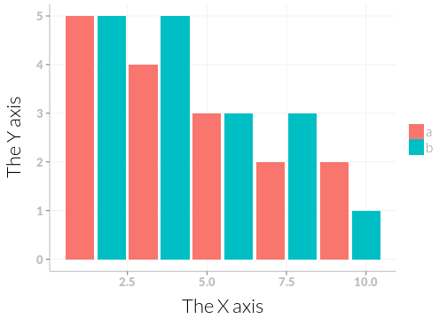

# ggplot2 themes

I will use this repo to collect themes.
I intend to write at least a basic theme and a presentation theme.

I will probably also write a theme to use in my nicely typesetted thesis as well as perhaps a poster theme and a blogpost theme.

## Base theme

