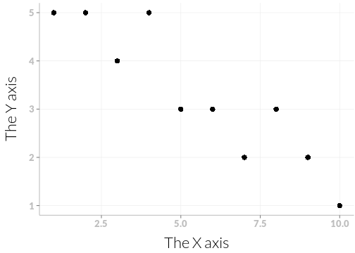

# ggplot2 themes

I will use this repo to collect themes.
I intend to write at least a basic theme and a presentation theme.

I will probably also write a theme to use in my nicely typesetted thesis as well as perhaps a poster theme and a blogpost theme.


## Base theme


```
## Loading required package: methods
```


```r
ggplot(d, aes(x = a, y = b, fill = c)) + 
  geom_bar(stat = 'identity', position=position_dodge()) +
  xlab('The X axis') + 
  ylab('The Y axis') +
  theme_tcdl
```

 

```r
ggplot(d, aes(x = a, y = b)) + 
  geom_point(size = 3.5) +
  xlab('The X axis') + 
  ylab('The Y axis') +
  theme_tcdl
```

 
